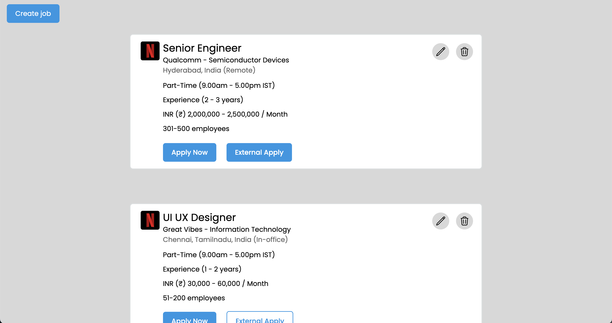
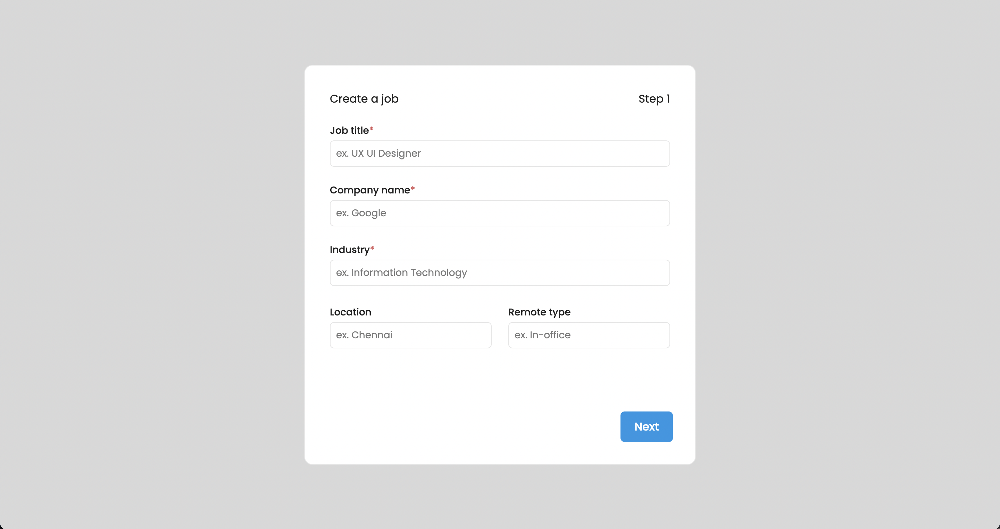
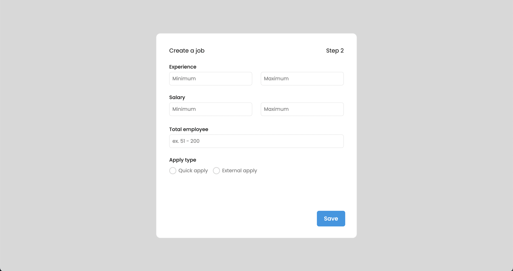
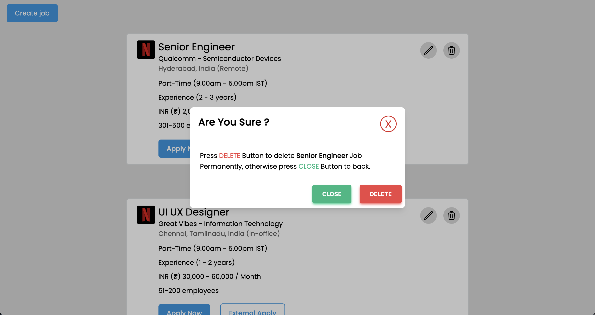
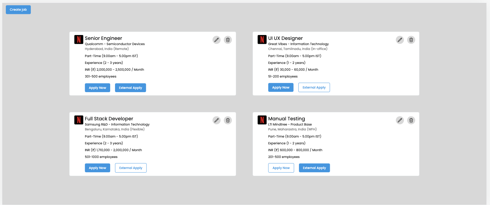

## Prerequisites

### Install Node JS

Refer to https://nodejs.org/en/ to install nodejs

### Install create-react-app

Install create-react-app npm package globally. This will help to easily run the project and also build the source files easily. Use the following command to install create-react-app

```bash
npm install -g create-react-app
```

## Cloning and Running the Application in local

Clone the project into local

Install all the npm packages. Go into the project folder and type the following command to install all npm packages

```bash
npm install
```

Then add your mockapi url key in .env file

```bash
REACT_APP_API_KEY=your_key
```

And create your project model by `data1` name.

In order to run the application Type the following command

```bash
npm start
```

The Application Runs on PORT(it will be dispayed in terminal)

## Screenshots

### Desktop version






